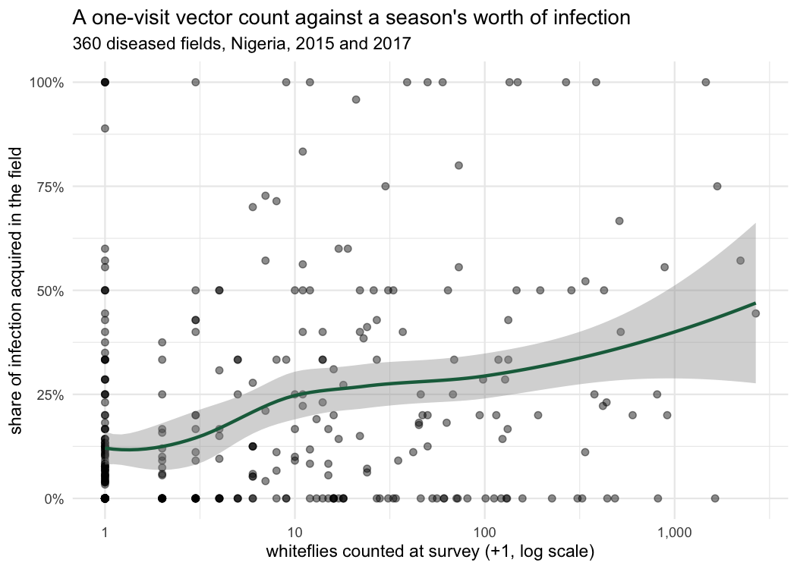

# Cassava mosaic disease in Nigeria: how much arrives on the cutting?

A reanalysis of the WAVE Covenant University Hub's published survey of cassava
mosaic begomoviruses across South-West and North-Central Nigeria, 2015 and 2017.

The dataset and the authors' own Python notebook are public under CC BY 4.0.
This repository does two things: it recomputes the published descriptive
results independently in R, and it draws one relationship the original notebook
reports the two halves of but never puts together.

**Nothing here corrects the original work.** The published numbers reproduce
exactly. The addition is a question, not a finding against anyone.

## The data

Eni A., Efekemo O., Onile-ere O., Pita J. (2021). *Survey of cassava mosaic
begomoviruses across South-west and North central regions of Nigeria in 2015
and 2017.* Mendeley Data, V1. [doi:10.17632/mpj2nxk3tk.1](https://doi.org/10.17632/mpj2nxk3tk.1)

Accompanying paper: Eni et al. (2021), *Annals of Applied Biology*,
[doi:10.1111/aab.12647](https://doi.org/10.1111/aab.12647).

512 fields across 13 states, 1,344 laboratory samples. `R/00_download.R` fetches
the file and refuses to continue unless its sha256 matches
`8a6bfe3f...651a84a`, so every number below refers to a known version.

## Running it

```
Rscript run_all.R
```

Needs `readxl`, `dplyr`, `tidyr`, `ggplot2`, `scales`, `digest`. Everything is
rebuilt from `data/raw/` alone.

## What reproduces

Recomputed in R with an independent Excel reader, against the authors' pandas
notebook (`DIB.ipynb`):

| | 2015 | 2017 |
|---|---|---|
| fields surveyed | 184 | 328 |
| CMD incidence | 43.8% | 12.3% |
| mean symptom severity | 2.73 | 2.15 |
| cutting-borne share of infection | 85.9% | 76.3% |
| whitefly-borne share | 14.1% | 23.7% |

## Most of this disease is planted, not caught

Across the 360 fields with any disease:

- median share attributable to planting material: **0.909**
- in **90.0%** of diseased fields, cuttings account for most of the infection
- in **39.2%**, they account for all of it

## The relationship the notebook does not draw

`DIB.ipynb` has a section headed *Origin of infection* (cells 18–26) and a
separate section headed *Whitefly Abundance* (cells 27–28). The two are never
related. Doing so:

| whiteflies counted | fields | median whitefly-borne share |
|---|---|---|
| 0 | 149 | 3.9% |
| 1–9 | 84 | 9.3% |
| 10–99 | 83 | 20.0% |
| 100–499 | 32 | 21.1% |
| 500+ | 12 | **42.2%** |

Monotonic, and not an artefact of pooling: Spearman rho is **+0.297** overall,
**+0.394** in 2015 and **+0.251** in 2017, **+0.265** in the South West and
**+0.221** in North Central. Every one of the thirteen states is positive
(0.01 to 0.57).



## Where the two measurements disagree, and why that is interesting

The correlation is real but loose, and the looseness looks structural rather
than noisy. From the methods: the route of infection is read from **the
distribution of symptoms on the plant**, while whiteflies were counted on **the
five topmost leaves of each of thirty plants** on a single visit.

Those measure different intervals. The symptom record integrates the whole
season; the vector count is one moment in it. The disagreements fall out
accordingly:

- **77 fields** — 51.7% of all fields where no whiteflies were counted — still
  show whitefly-borne infection, with a mean share of 0.236. Four attribute
  100% of their infection to whiteflies on a count of zero.
- **13 fields** had 100 or more whiteflies and no whitefly-borne infection at
  all, the largest being **1,633 whiteflies** in Lagos in 2017.

So the open question is not whether the data are good. It is how much of a
season's transmission a point estimate of vector abundance can be expected to
carry, and whether the residual scatter here is mostly sampling time, mostly
spatial aggregation, or mostly something about the vector's own dynamics.

That is a modelling question rather than a survey one, and it is the reason
this repository exists.

## Layout

```
R/00_download.R        fetch from Mendeley, verify sha256
R/01_load.R            load three sheets, map states to zones, assert structure
R/02_reproduce.R       recompute the published descriptives
R/03_route_vs_vector.R the relationship above, plus figures
run_all.R              runs all four in order
```

## Licence

The data are CC BY 4.0 (Eni, Efekemo, Onile-ere and Pita, 2021) and are
redistributed here under that licence. The code in this repository is MIT.
